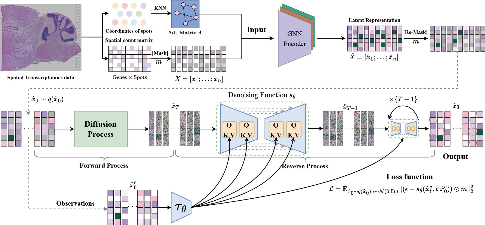

# stMCDI: Masked Conditional Diffusion Model with Graph Neural Network for Spatial Transcriptomics Data Imputation



## Setup

```python
pip install -r requirement.txt
```

## Download dataset

please check ./data

## Running experiments

```
python main.py
```

